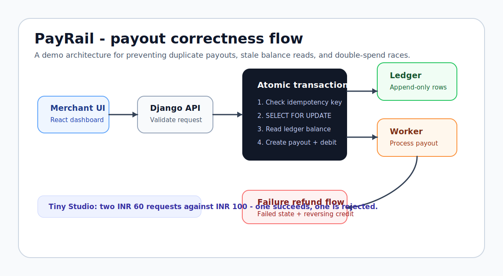
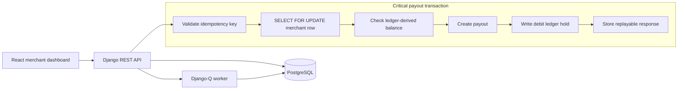

# PayRail - Real-Time Payout Engine

A payout engine demo for real-world banking payment flows. Merchants can view balances, request payouts, and track payout status while the backend preserves money integrity through an append-only ledger, idempotency keys, row-level locking, and explicit payout state transitions.

This is an engineering demo. It does not integrate with real banks and does not move real money.

**Live demo:** [https://playto-pay-engine.onrender.com](https://playto-pay-engine.onrender.com)



## Why This Exists

Payout systems fail in subtle ways. A backend can look correct in happy-path tests while still allowing duplicate payouts, overdrafts, stale balance reads, or impossible status transitions under retries and concurrent requests.

PayRail focuses on the correctness layer behind a payout product:

- Merchant balances are derived from an append-only ledger.
- Payout requests reserve funds before background processing starts.
- Duplicate client retries are handled with idempotency keys.
- Concurrent payout requests are serialized with PostgreSQL row locks.
- Payout status moves through a small explicit state machine.
- Failed payouts refund held funds with a reversing ledger entry.

## Architecture



## Stack

- **Backend:** Django + Django REST Framework
- **Task queue:** Django-Q with PostgreSQL ORM broker
- **Frontend:** React + Vite + Tailwind CSS
- **Database:** PostgreSQL
- **Deployment:** Multi-stage Docker image that bundles the React build into Django static files

## Demo Data

The seed command creates three demo merchants:

| Merchant | API key | Starting balance |
| --- | --- | --- |
| Acme Agency | `api-key-acme-agency` | INR 10,000 |
| Freelancer Fiaz | `api-key-freelancer-fiaz` | INR 5,000 |
| Tiny Studio | `api-key-tiny-studio` | INR 100 |

Use Tiny Studio to test double-spend prevention by firing two simultaneous INR 60 payout requests. Exactly one request should reserve funds; the other should be rejected once it reads the updated ledger balance.

## API

All API endpoints require:

```http
Authorization: Api-Key <demo-api-key>
```

Payout creation also requires:

```http
Idempotency-Key: <uuid>
```

| Method | Endpoint | Description |
| --- | --- | --- |
| `GET` | `/api/v1/me/` | Merchant profile, available balance, and held balance |
| `GET` | `/api/v1/ledger/` | Recent append-only ledger entries |
| `GET` | `/api/v1/payouts/` | Recent payout history |
| `POST` | `/api/v1/payouts/` | Create a payout request and reserve funds |

Example payout request:

```bash
curl -X POST http://localhost:8000/api/v1/payouts/ \
  -H "Authorization: Api-Key api-key-tiny-studio" \
  -H "Idempotency-Key: 00000000-0000-4000-8000-000000000001" \
  -H "Content-Type: application/json" \
  -d '{"amount_paise":6000,"bank_account_id":"demo-bank-account"}'
```

## Running Locally

Requires Docker and Docker Compose.

```bash
docker-compose up --build
```

Local services:

- Frontend: `http://localhost:5173`
- Backend API: `http://localhost:8000`
- Django admin: `http://localhost:8000/admin/`

The compose stack starts PostgreSQL, the Django API, a Django-Q worker cluster, and the Vite dev server.

## Running Tests

```bash
docker-compose exec web python manage.py test payouts
```

For fast local checks without PostgreSQL:

```bash
cd backend
python manage.py test payouts --settings=playto.test_settings
```

The SQLite path is useful for model and API checks. PostgreSQL is the authoritative path for validating `SELECT FOR UPDATE` behavior.

## Deployment

Build the production image:

```bash
docker build -t payrail-payout-engine .
```

Production environment variables:

- `SECRET_KEY` - Django secret key
- `DATABASE_URL` - PostgreSQL connection string
- `DEBUG=0`

The root Dockerfile builds the React frontend first, then copies the static bundle into Django.

For demo resets, set `RESET_DATA=1` before deployment. The container will clear payouts, ledger entries, and idempotency keys, then restore the three demo merchants. Remove the variable after the reset.

## Engineering Notes

See [EXPLAINER.md](EXPLAINER.md) for the detailed writeup on ledger design, concurrency control, idempotency, payout state transitions, refund atomicity, and the AI-generated balance bug that was replaced with a single database aggregation.

## Status

Prototype payout-system correctness demo. The repo is intended to show backend and product engineering decisions around money movement simulations, not production banking integration.
